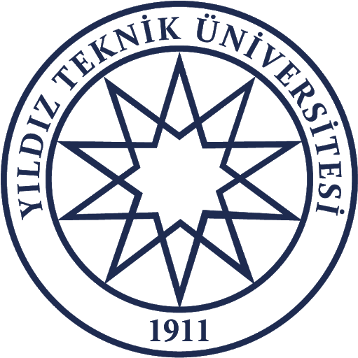

## OpenCV 4 Tutorials
---
*Vefak Murat Akman* 

This repo contains some OpenCV 4 tutorials. With these tutorials, people can learn some basic Opencv methods. Codes are explained by comments. 
#### Tutorials:

1. Load Image
2. Create Blank Image
3. Streaming Local Video
4. Capture Video from Webcam
5. Adjust Image Brightness
6. Adjust Video Brightness
7. Adjust Contrast
8. Histogram Equalization
9. Filters
10. Morphological Operation
11. More Morphological Operations
12. Trackbar
13. Trackbar Callback Function
14. Rotation
15. Mouse Operations
16. Color Recognition

